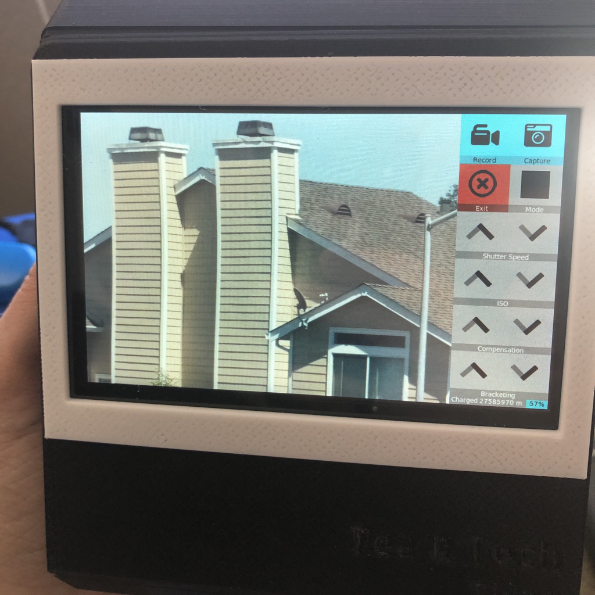

# Pieca Camera Software

Learn more about the full design from my Blog Post
[Tea and Tech Time: Pieca Camera System](https://teaandtechtime.com/pieca-a-raspberry-pi-camera-system-for-leica-m-mount-lenses/)

I forked the bulk of this code from eat-sleep-code's camera repo for the software interface to the Pieca camera system. I added Pi GPIO functionality to trigger the shutter, power off the camera, and a simple battery monitor to automatically turn off the camera when the battery is running out. 

I also added an auto start script that can be called at boot by placing the .desktop file in the raspberry pi .config/autostart folder.

# User Interface



# Compatibility Notice

Due to breaking changes in the Raspberry Pi OS camera stack, this software will **not** work with the recent *Bullseye* version of Raspberry Pi OS.   A new integration library is currently under development by the Raspberry Pi Foundation with a planned release in early 2022.   Our camera software will be updated to take advantage of this integration library when it becomes publicly available.

In the meantime, if you wish to use this software you will need to install the *Buster* version of Raspberry Pi OS.

---

# Camera

This program makes the use of a Raspberry Pi HQ camera a little more powerful and user-friendly.   It unleashes easy exposure bracketing, timelapse functionality, etc.   It also adds on-screen controls for use with touch screens, additional error handling, and presets for some common settings.

---
## Getting Started

- Use [raspi-config](https://www.raspberrypi.org/documentation/configuration/raspi-config.md) to:
  - Set the Memory Split value to a value of at least 256MB
  - Enable the CSI camera interface
  - Set up your WiFi connection
- Connect the Raspberry Pi HQ Camera to your Raspberry Pi


## Installation

Installation of the program, any software prerequisites, as well as DNG support can be completed with the following two-line install script.

```
wget -q https://raw.githubusercontent.com/Tschucker/Pieca-camera-software/master/install-camera.sh -O ~/install-camera.sh
sudo chmod +x ~/install-camera.sh && ~/install-camera.sh
```

---

## Usage
```
camera <options>
```

### Options

+ _--action_ : Set the camera action     *(default: capture)*
+ _--shutter_ : Set the shutter speed in milliseconds     *(default: auto)*
+ _--iso_ : Set the ISO     *(default: auto)*
+ _--exposure_ : Set the exposure mode     *(default: auto)*
+ _--ev_ : Set the exposure compensation (+/-10)     *(default: 0)*
+ _--bracket_ : Set the exposure bracketing value     *(default: 0)*
+ _--awb_ : Set the Auto White Balance (AWB) mode      *(default: auto)*
+ _--outputFolder_ : Set the folder where images will be saved     *(default: dcim/)* 
+ _--raw_ : Set whether DNG files are created in addition to JPEG files	    *(default: True)*
+ _--timer_ : Set the interval for timelapse mode in seconds     *(default: 0)* 
+ _--previewWidth_ : Set the preview window width     *(default: 800)*
+ _--previewHeight_ : Set the preview window height    *(default: 460)*

### Keyboard Controls
+ Press s+&#x25B2; or s+&#x25BC; to change shutter speed
+ Press i+&#x25B2; or i+&#x25B2; to change ISO
+ Press c+&#x25B2; or c+&#x25B2; to change exposure compensation
+ Press b+&#x25B2; or b+&#x25B2; to change exposure bracketing
+ Press [p] to toggle the preview window
+ Press the [space] bar to take photos or begin a timelapse
+ Press &#x241B; to exit

### Web Controls
If you need to control your camera via a web-based interface, please see [camera.remote](https://github.com/eat-sleep-code/camera.remote).

---

## Autostart at Desktop Login

To autostart the program as soon as the Raspberry Pi OS desktop starts, execute the following command:

```
sudo nano /etc/xdg/lxsession/LXDE-pi/autostart
```

Add the following line to the end of the file and then save the file:

```
@lxterminal --geometry=1x1 -e sudo python3 /home/pi/camera/camera.py
```
---

## Infrared Cameras
If you are using an infrared (IR) camera, you will need to modify the Auto White Balance (AWB) mode at boot time.

This can be achieved by executing `sudo nano /boot/config.txt` and adding the following lines.

```
# Camera Settings 
awb_auto_is_greyworld=1
```

Also note, that while IR cameras utilize "invisible" (outside the spectrum of the human eye) light, they can not magically see in the dark.   You will need to illuminate night scenes with one or more [IR emitting LEDs](https://www.adafruit.com/product/387) to take advantage of an Infrared Camera.

---

:information_source: *This application was developed using a Raspberry Pi HQ (2020) camera and Raspberry Pi 3B+ and Raspberry Pi 4B boards.   Issues may arise if you are using either third party or older hardware.*
